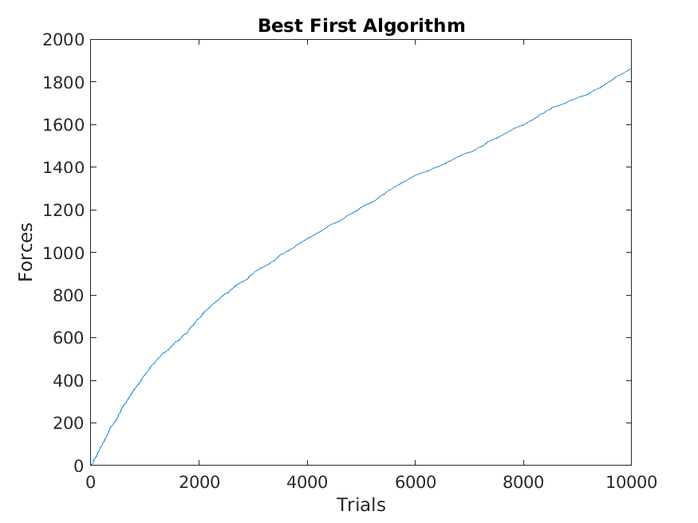
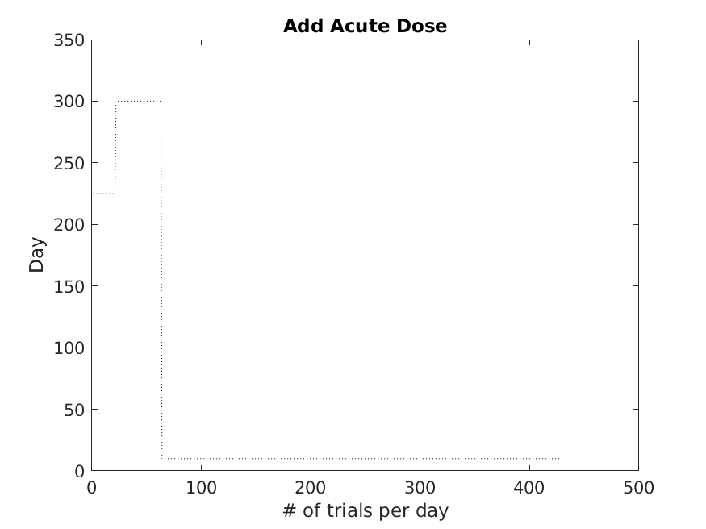
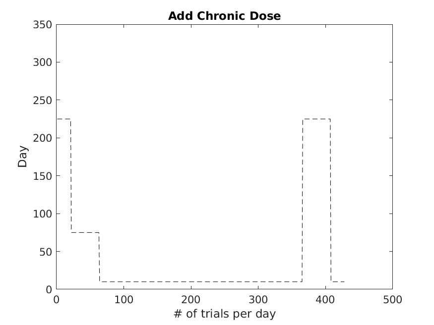
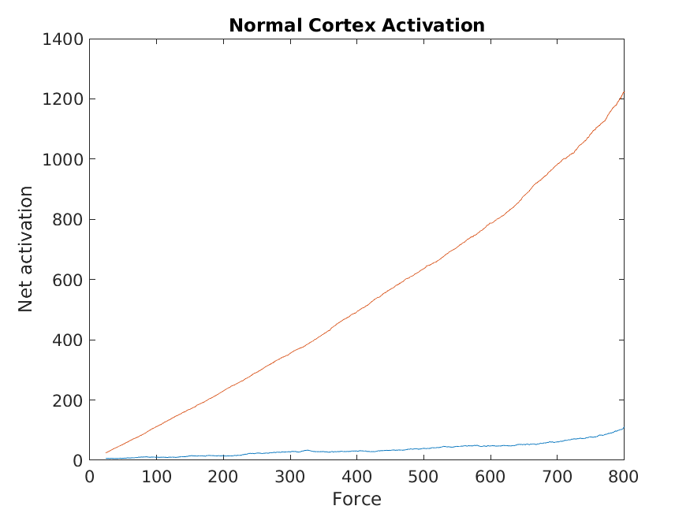
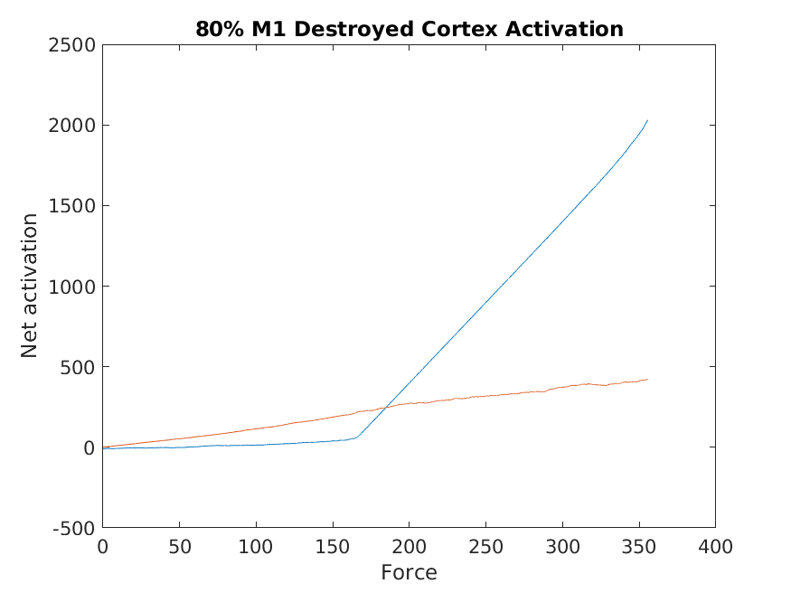

# Motor Recovery
## Reinforcement Learning
1000 Residual CS Cells
Best First             |  Stochastic Gradient Descent
:-------------------------:|:-------------------------:
  | 

## Rehabilitation Excercise Protocols
Normal Therapy | Normal Therapy + Acute Dose | Normal Therapy + Chronic Dose
:-------------------------:|:-------------------------:|:-------------------------:
  | | 

Severely Impaired - Red Line - 1000 Residual CS Cells\
Moderately Impaired - Blue Line - 2000 Residual CS Cells

Normal Therapy - Solid Line\
Normal Therapy + Acute Dose - Dotted Line\
Normal Therapy + ChronicDose - Dashed Line\
 

## SMA (Secondary Motor Area) & M1 (Primary Motor Area) Cortex 
Normal Cortex | M1 Destroyed 50% | M1 Destroyed 80%
:-------------------------:|:-------------------------:|:-------------------------:
 | | 
 | | 
 | | 